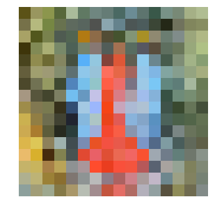

# CS131: Computer Vision Foundations and Applications
This repository contains the released assignment for the fall 2020 of CS131, a course at Stanford taught by [Juan Carlos Niebles](http://www.niebles.net/) and [Ranjay Krishna](http://ranjaykrishna.com/index.html).

## Assignments
* Environment: python3.6+
* Requirements: run     "pip install -r requirements.txt"

## hw0: [[link]](https://github.com/RRRChangeche/Stanford_CS131_2020/tree/main/fall_2020/hw0_release)
* Linear Algebra and Numpy review 
* Image manipulation
    - laod image 
    - crop image
    - image dimmer
    - resize image
    - Rotating 2D coordinates
    - Rotate image 
    

## hw1: [[link]](https://github.com/RRRChangeche/Stanford_CS131_2020/tree/main/fall_2020/hw1_release)
* Convolution

