# CS131: Computer Vision Foundations and Applications

This repository contains the released assignment for the fall 2020 of CS131, a course at Stanford taught by [Juan Carlos Niebles](http://www.niebles.net/) and [Ranjay Krishna](http://ranjaykrishna.com/index.html).

## Assignments

* Environment: python3.6+
* Requirements: run     "pip install -r requirements.txt"

## hw0: [[link]](https://github.com/RRRChangeche/Stanford_CS131_2020/tree/main/hw0_release)

* Linear Algebra and Numpy review
* Image manipulation
  * laod image
  * crop image
  * image dimmer
  * resize image
  * Rotating 2D coordinates
  * Rotate image
  
| load image | blur | rotate |
| ------------- | ------------- | ------------- |
|   |   |   |

## hw1: [[link]](https://github.com/RRRChangeche/Stanford_CS131_2020/tree/main/hw1_release)

* Convolution
  * prove Commutative property
  * prove Shift invariance
  * prove Linearity
  * Implementation
    * conv_nested - using 4 for-loops
    * conv_fast - using zero-pad and numpy dot product
      1. zero padding
      2. flip kernel vertically and horizontally
      3. compute weighted sum

* Cross-correlation
  * Template matching
  * Zero-mean cross-correlation
  * Normalized cross-correlation

* Separable Filter
  * Theory
  * Complexity comparison

> What I've learned?
>
> * Optimize convolution implementaion by using numpy(conv_fast).
> * It's about up to 15x faster than naive implementation(conv_nested) in this case.
>
> * The `Zero-mean Cross-Correlation` is not robust to change in lighting condition.
>
> * Implement template matching by `Normalized Cross-Correlation` algorithm to search the target pattern in the source image.
>
> * 2D separable convolution is equivalent to two 1D convolutions.
>
> * Optimize 2D convolution by doing two 1D convolutoins.
>
> * It's about 2x faster by using separable filter in this case.

|Pictures|
|-|
|**Convolution**|
|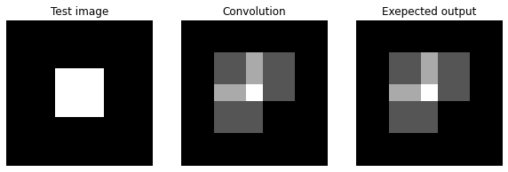|
|**Zero-mean cross-correlation**|
|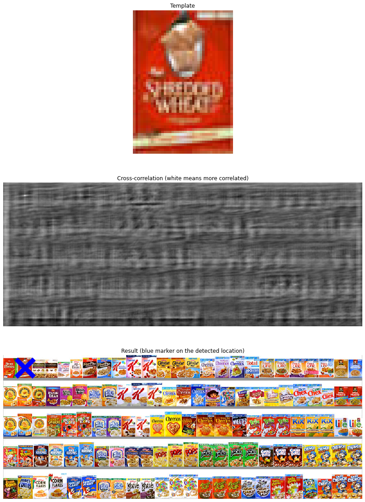 |
|**Normalized cross-correlation**|
|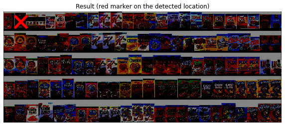 |
|**Normal V.S. Separable convolution**|
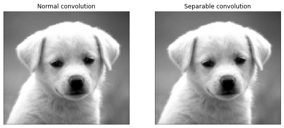

## Recitation 4 - Advanced Numpy Tutorial: [[link]](https://github.com/RRRChangeche/Stanford_CS131_2020/tree/main/hw1_release)

* Creating numpy array
* Array Attributes
* Accessing elements
* Matrix operations
  * Element-wise operation - all arithmetic operations are applied to a matrix element-wise
    * +, -, *, /
    * sqrt/ power
  * Axis-based operations
    * mean
    * std
    * sum
  * Some other useful manipulations
    * concatenate
    * tranpose
    * linalg.inv - to invert a matrix 
* Numpy for linear algebra
  * Dot product - np.dot - return scalar
  * np.matmul/ @
* Numpy arrays, references, and *copies*
  * import copy/ copy.copy() and copy.deepcopy()
  * np.array.copy()
* Sorting
  * np.sort - return sorted array
  * np.argsort - return sorted indices
* Reshaping 
* Broadcsting
* Using boolean masks
  * boolean masks
  * np.where
* Linear Algebra
  * np.linalg.slove
  * np.linalg.lstsq
  * $\theta = (X^T X)^{-1} X^T y$
* Vectorize equations

> What I've learned?
>
> * All arithmetic operations are applied to a matrix element-wise.
>
> * Numpy operation is way faster than list.
>
> * Reference of numpy array, point to the same object. Use `copy` to fix this. 
>
> * Be aware of `copy` and `deepcopy`.
>
> * Broadcasting - Two dimensions are compatible when `they are equal`, or `one of them is 1`. [(details)](https://numpy.org/doc/stable/user/basics.broadcasting.html)
> ex: c = a*b, when a's shape is (1,3)/ b's shape is (3,1), then c's shape is (3,3) because of broadcasting  operation.
>

## hw2: [[link]](https://github.com/RRRChangeche/Stanford_CS131_2020/tree/main/hw2_release)

* Canny edge detector
  1. Smoothing
  2. Finding gradients
  3. Non-maximum suppression
  4. Double thresholding
  5. Edge tracking by hysterisis
  6. Optimize parameters
* Lane detection
  * Edge detection
  * Extracting Region of Interest (ROI)
  * Fitting lines using Hough Transform

> What I've learned?
>
> * **Implement Gaussian filter**
>
> * **Implement Gradient and calculate it's magnitude and direction of each pixel.**
>
> * **NMS steps:**
>   * Round the gradient direction to the nearest 45 degrees, corresponding to the use if an 8-conntected neighbourhood. $[0,45,90,135,180,225,270,315]$
>   * Compare the edge strength of the current pixel with the edge strength of the pixel along with positive and negative geadient directions
>   * If the edge strength of the current pixel if the largest, then preserve the value of the edge strength. If not, suppress (i.e. remove) the value.
>
> * **Hough Transform steps:**
>   * Find edges using Canny edge detector
>   * Map edge points to Hough Space (r-theta coordinate)
>   * Store mapped points in accumulator
>   * Interpretate the accumulator to yield lines of infinite length
>   * Converse infinite lines to finite lines
>   * [Reference](https://web.ipac.caltech.edu/staff/fmasci/home/astro_refs/HoughTrans_lines_09.pdf)

|Pictures|
|-|
|**Smooth**|
|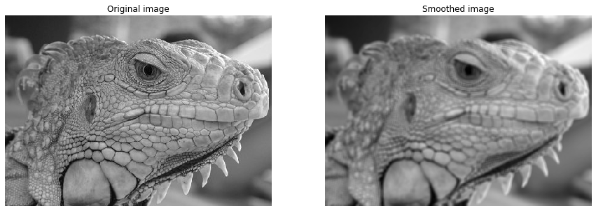 |
|**Grdient of x and y**|
|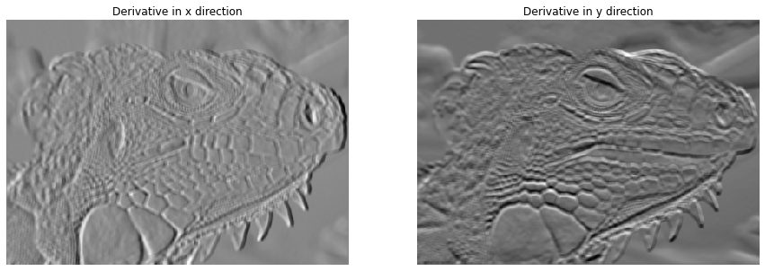 |
|**NMS**|
|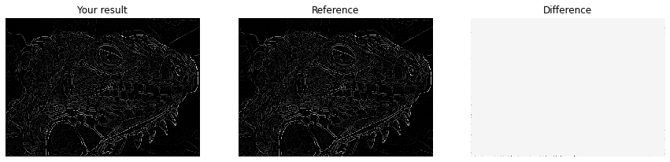 |
|**Double Thresholding**|
|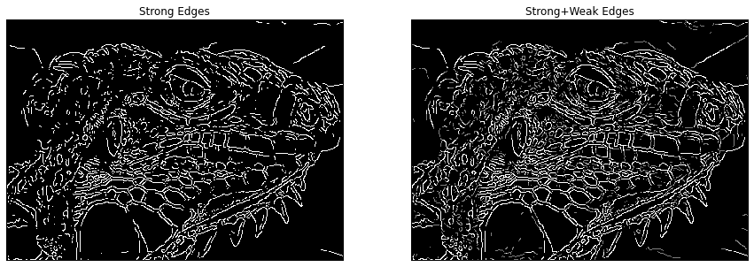 |
|**Edge tracking by hysterisis**|
|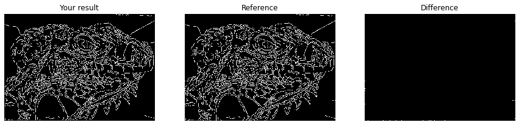 |
|**Edge detection**|
|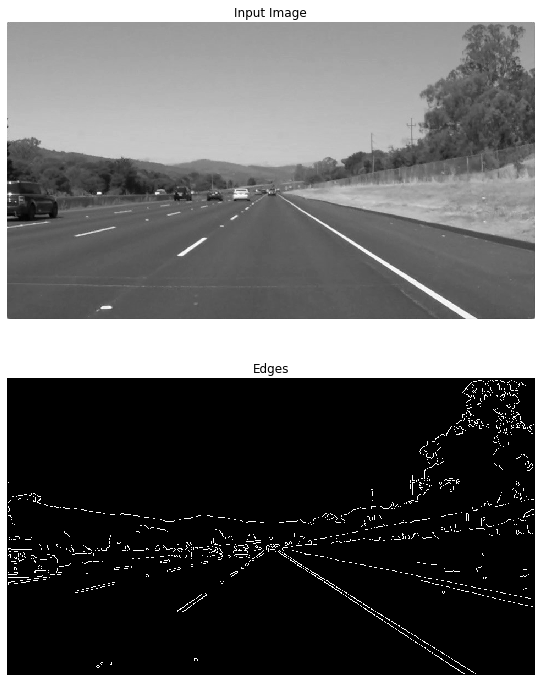 |
|**ROI**|
|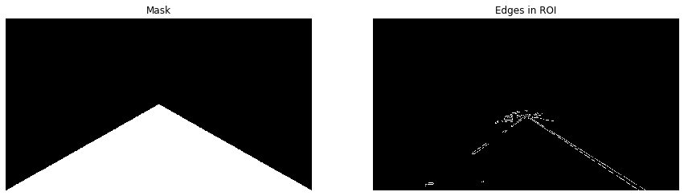 |
|**Hough transform**|
|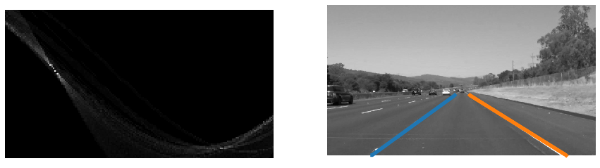 |

## hw3: [[link]](https://github.com/RRRChangeche/Stanford_CS131_2020/tree/main/hw3_release)

* Harris corner detector
* Describing and Matching Keypoints
* Transformation Estimation
* RANSAC
* Histogram of Oriented Gradients (HOG)
* Better Image Merging - Linear Blending
* Stitching Multiple Images

> What I've learned?
>
> * **Harris corner detector**
>   * A method to get keypoints of the image.
>   * Steps:
>     1. Compute Ix and Iy derivatives of an image.
>     2. Compute product of Ix^2/ Iy^2/ IxIy at each pixel
>     3. Apply Gaussian smooth to 2. to get Sxx/ Syy/ Sxy
>     4. Compute matrix M at each pixel and eigen value of M
>     5. Compute response value R at each pixel, where R = Det(M)-k(Trace(M)^2)
>     6. Use function `corner_peaks` from `skimage.feature` to get local maxima of response map by performing NMS and **localize keypoints**
>
> * **Describing and Matching Keypoints**
>   * Creating descriptors
>     * Give each keypoints a patch
>     * Normalize patch and then flattening into a 1D array
>   * Matching descriptors
>	    * Calculate Euclidean distance between all pairs of descriptors form image1 to image2 (use `scipy.spatial.distance.cdist(desc1, desc2, 'euclidean')`)
>	    * Store 'match descriptors', if (first-closest pairs/ second-closest pairs) < threshold, then first-closest pairs is match
>
> * **Transformation Estimation**
>   * Use least square to calculate affine transformation matrix H letting p2*H = p1 (use `np.linalg.lstsq`)
>
> * **RANSAC**
>   * Steps:
>     1. Given parameters:
>        * n_iters: number of iterations
>        * threshold: limitation for inliers
>     2. Select a random set of matches
>     3. Compute affine transformation matrix letting p2*H = p1 (use `np.linalg.lstsq`)
>     4. Compute the number of inliers via Euclidean distance within the threshold (use `np.linalg.norm(...ord=2)`)
>     5. Keep the model with the most number of inliers
>     6. Re-compute least-squares estimate on all of the inliers
>
> * **Histogram of Oriented Gradients (HOG)**
>   * A method to describe keypoint
>   * Steps:
>     1. Compute the gradient image in x and y directions
>        * Use the sobel filter provided by skimage.filters
>     2. Compute gradient histograms
>        * Divide image into cells, and calculate histogram of gradients in each cell
>     3. Flatten block of histograms into feature vector
>     4. Normalize flattened block by L2 norm
>
> * **Better Image Merging - Linear Blending**
>   * Define left and right margins for blending to occur between
>   * Define a weight matrix for image 1 such that:
> 	  * From the left of the output space to the left margin the weight is 1
>     * From the left margin to the right margin, the weight linearly decrements from 1 to 0
>   * Define a weight matrix for image 2 such that:
> 	  * From the right of the output space to the right margin the weight is 1
> 	  * From the left margin to the right margin, the weight linearly increments from 0 to 1
>   * Apply the weight matrices to their corresponding images
>   * Combine the images
>
> * **Stitching Multiple Images**
>   * Combine the effects of multiple transformation matrices

|Pictures|
|-|
|**Harris corner response**|
|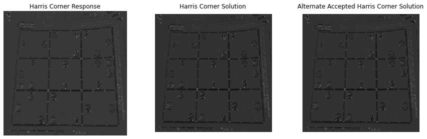 |
|**Keypoinnts**|
|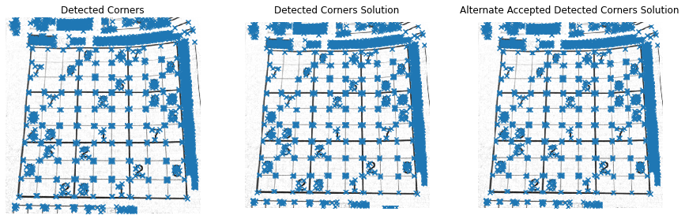 |
|**Describing and matching keypoints (simple descriptor)**|
|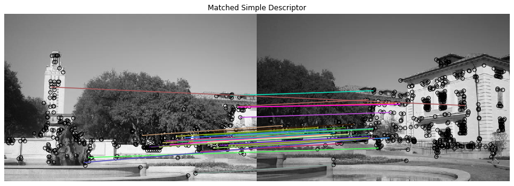 |
|**Transformation matrix H with `least square` method**|
|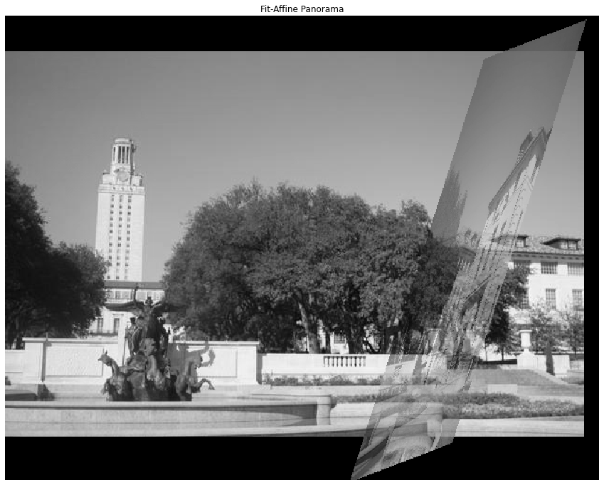 |
|**Transformation matrix H with `RANSAC` method(Robust matches)**|
|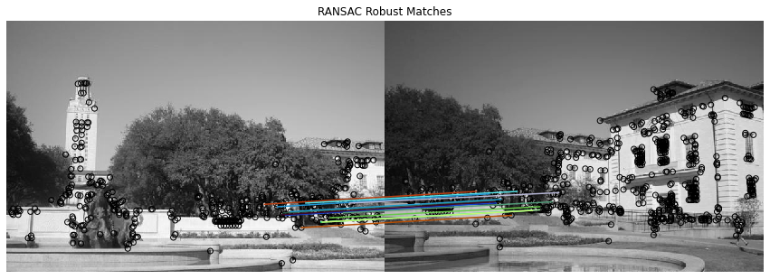 |
|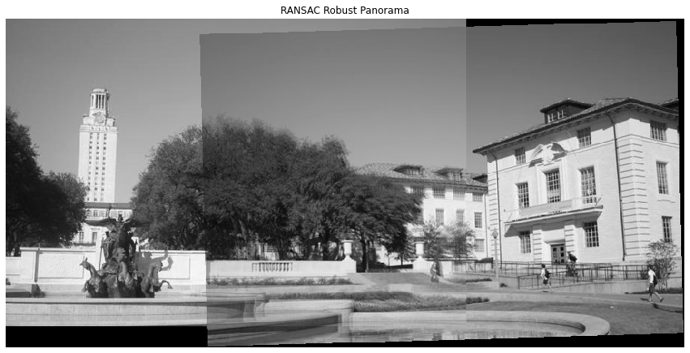 |
|**HOG descriptor**|
|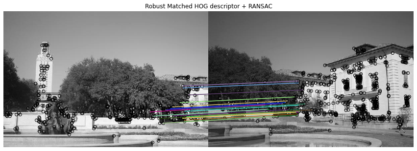 |
|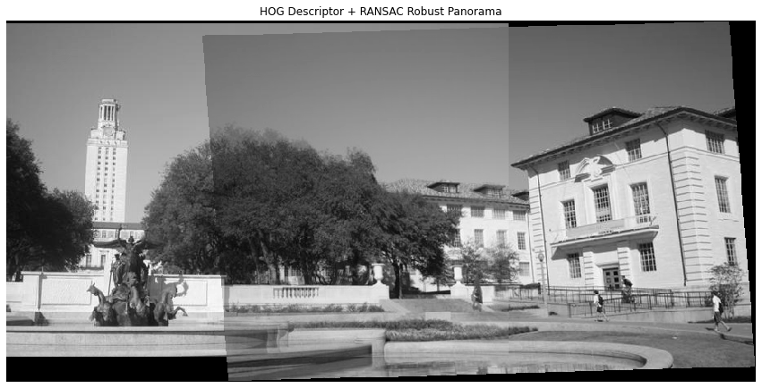 |
|**Better Image Merging - Linear Blending**|
|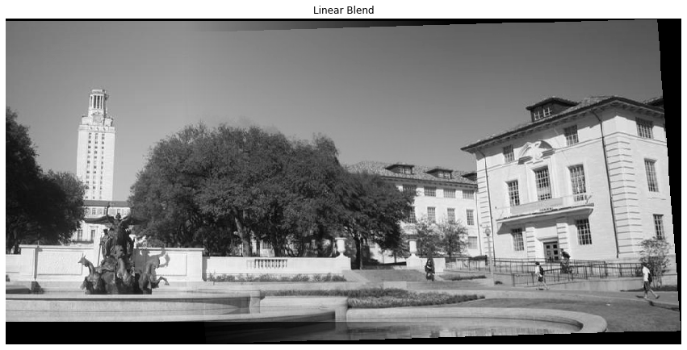 |
|**Stitching Multiple Images**|
|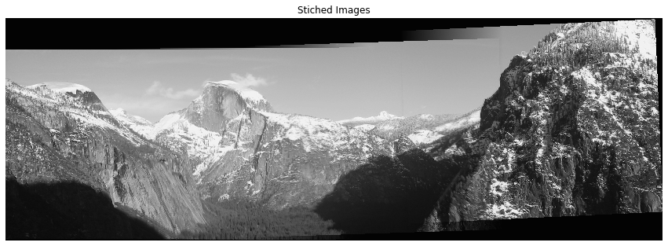 |

## hw4: [[link]](https://github.com/RRRChangeche/Stanford_CS131_2020/tree/main/hw4_release)

* Clustering Algorithm
  * K-Means Clustering
  * K-Means Convergence
  * Heirarchical Agglomerative Clustering (HAC)
* Pixel-Level Features
  * Color features
  * Color and Position Features
* Extra Credit: Implement Your Own Feature
* Quantitative Evaluation

> What I've learned?
>
> * **K-Means Clustering**
>   * An algorithm for clustering by comparing distances between every point to clusters with the given parameter k.
>   * k: number of clusters
>   * Steps:
>     1. Randomly initialize k cluster centers
>     2. Assign each point to the closest center
>     3. Recompute the new center of each cluster
>     4. Stop if cluster assignments did not change
>     5. Otherwise, go back to step 2
>
> * **Heirarchical Agglomerative Clustering (HAC)**
>   * An algorithm for clustering by merging the closest pair of clusters with the given parameter k.
>   * k: number of clusters
>   * Steps:
>     1. Each point is its own cluster in the beginning
>     2. Compute centers of every clusters
>     3. Compute euclidean distances between every pairs of clusters (use `pdist` import from `scipy.spatial.distance`)
>     4. Merge the closest pair of cluster as a new cluster
>     5. Repeat steps 2-4 until k clusters remain
>
> * How to improve the performance of the segmentation algorithm by modifying parameters.
>  

|Pictures|
|-|
|**Clustering Algorithm**|
|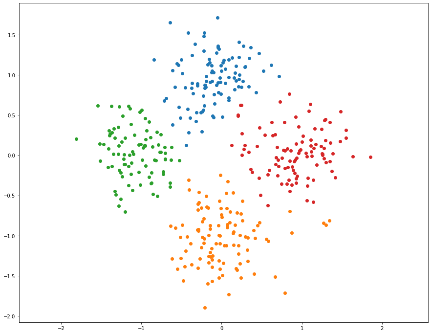 |

|**Pixel-Level Features**|
|-|
|Original|
| 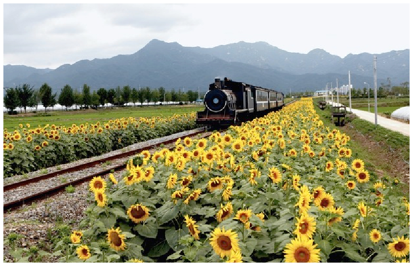 |

| Color Features | Visualization |
|-|-|
| 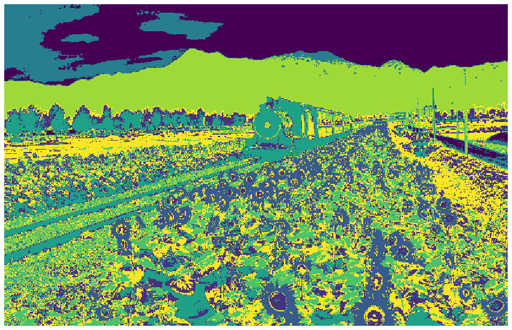 | 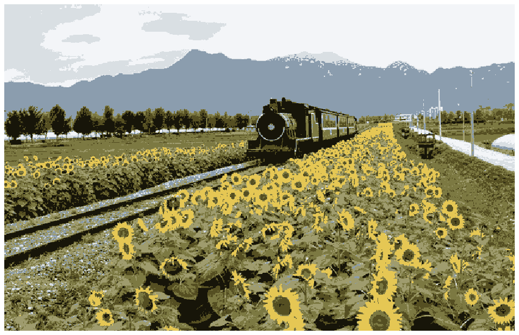 |

| Color and Position Features | Visualization |
|-|-|
| 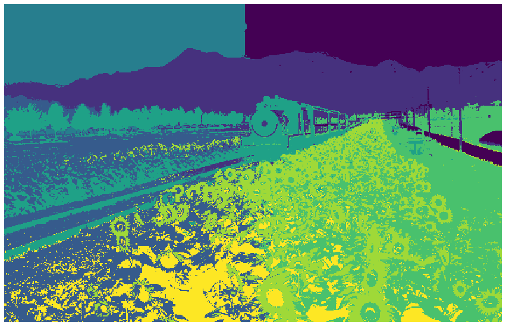 | 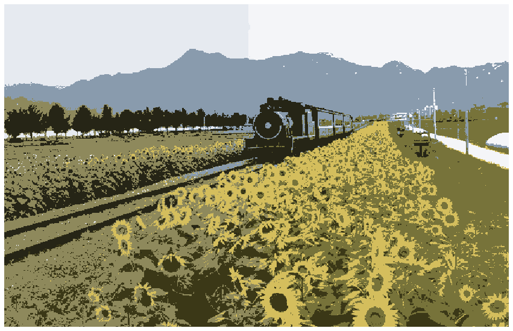 |

| My Features | Visualization |
|-|-|
| 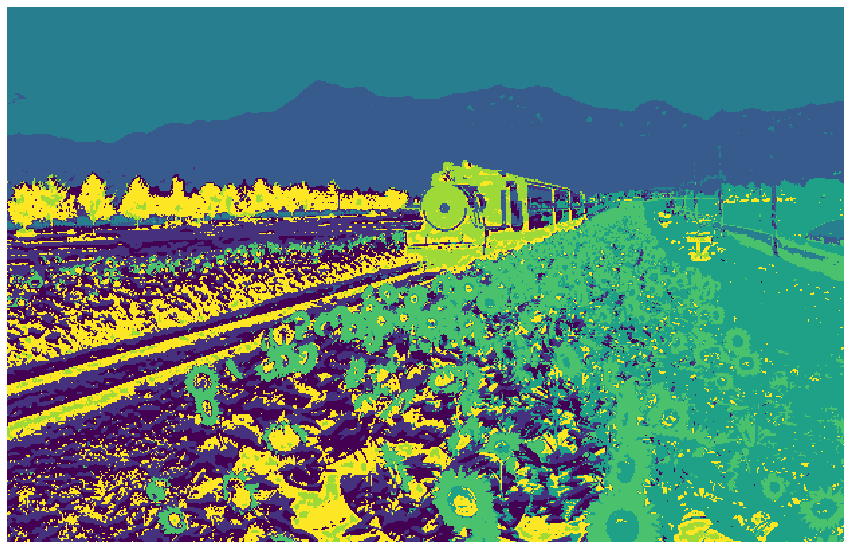 | 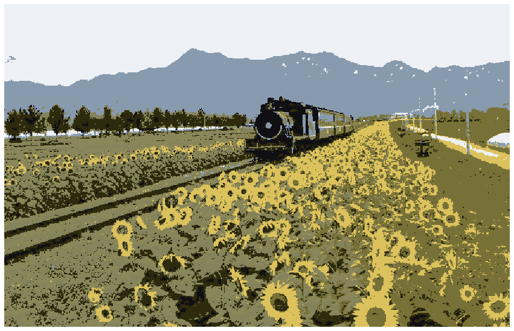 |

|**Quantitative Evaluation**|
|-|
|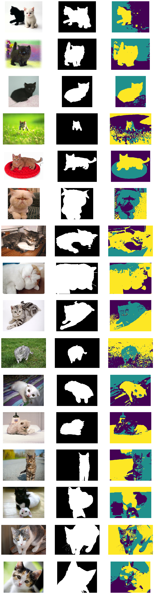 |
