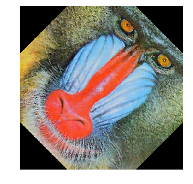
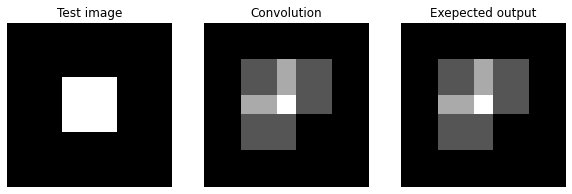
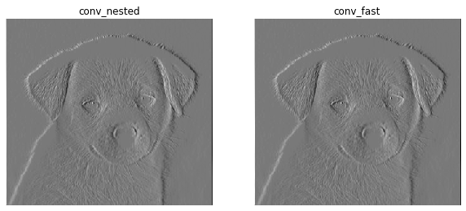
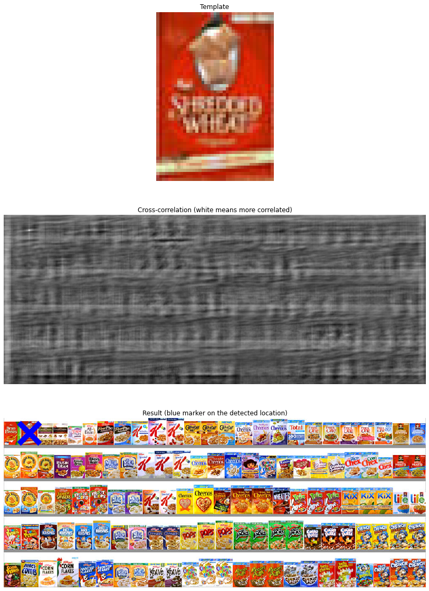
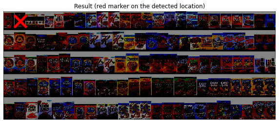
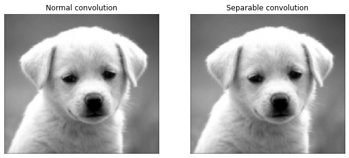

# CS131: Computer Vision Foundations and Applications

This repository contains the released assignment for the fall 2020 of CS131, a course at Stanford taught by [Juan Carlos Niebles](http://www.niebles.net/) and [Ranjay Krishna](http://ranjaykrishna.com/index.html).

## Assignments

* Environment: python3.6+
* Requirements: run     "pip install -r requirements.txt"

## hw0: [[link]](https://github.com/RRRChangeche/Stanford_CS131_2020/tree/main/fall_2020/hw0_release)

* Linear Algebra and Numpy review
* Image manipulation
  * laod image
  * crop image
  * image dimmer
  * resize image
  * Rotating 2D coordinates
  * Rotate image
  

## hw1: [[link]](https://github.com/RRRChangeche/Stanford_CS131_2020/tree/main/fall_2020/hw1_release)

* Convolution
  * prove Commutative property
  * prove Shift invariance
  * prove Linearity
  * Implementation
    * conv_nested - using 4 for-loops
    * conv_fast - using zero-pad and numpy dot product
      1. zero padding
      2. flip kernel vertically and horizontally
      3. compute weighted sum

> What I've learned?
>
> * Optimize convolution implementaion by using numpy(conv_fast).
> * It's about up to 15x faster than naive implementation(conv_nested) in this case.

* Cross-correlation
  * Template matching
  * Zero-mean cross-correlation
  * Normalized Cross-correlation

> What I've learned?
>
> * The `zero_mean_cross_correlation` is not robust to change in lighting condition.
>
> * Implement template matching by normalized Cross-correlation algorithm to search the target pattern in the source image.

* Separable Filter
  * Theory
  * Complexity comparison

> What I've learned?
>
> * 2D separable convolution is equivalent to two 1D convolutions.
>
> * Optimize 2D convolution by doing two 1D convolutoins.
>
> * It's about 2x faster by using separable filter in this case.

## Recitation 4 - Advanced Numpy Tutorial: [[link]](https://github.com/RRRChangeche/Stanford_CS131_2020/tree/main/fall_2020/hw1_release)

* Creating numpy array
* Array Attributes
* Accessing elements
* Matrix operations
  * Element-wise operation - all arithmetic operations are applied to a matrix element-wise
    * +, -, *, /
    * sqrt/ power
  * Axis-based operations
    * mean
    * std
    * sum
  * Some other useful manipulations
    * concatenate
    * tranpose
    * linalg.inv - to invert a matrix 
* Numpy for linear algebra
  * Dot product - np.dot - return scalar
  * np.matmul/ @
* Numpy arrays, references, and *copies*
  * import copy/ copy.copy() and copy.deepcopy()
  * np.array.copy()
* Sorting
  * np.sort - return sorted array
  * np.argsort - return sorted indices
* Reshaping 
* Broadcsting
* Using boolean masks
  * boolean masks
  * np.where
* Linear Algebra
  * np.linalg.slove
  * np.linalg.lstsq
  * $\theta = (X^T X)^{-1} X^T y$
* Vectorize equations 

> What I've learned?
>
> * All arithmetic operations are applied to a matrix element-wise.
>
> * Numpy operation is way faster than list.
>
> * Reference of numpy array, point to the same object. Use `copy` to fix this. 
>
> * Be aware of `copy` and `deepcopy`.
>
> * Broadcasting - Two dimensions are compatible when `they are equal`, or `one of them is 1`. [(details)](https://numpy.org/doc/stable/user/basics.broadcasting.html)
> ex: c = a*b, when a's shape is (1,3)/ b's shape is (3,1), then c's shape is (3,3) because of broadcasting  operation.
>
