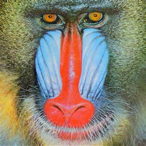

# CS131: Computer Vision Foundations and Applications

This repository contains the released assignment for the fall 2020 of CS131, a course at Stanford taught by [Juan Carlos Niebles](http://www.niebles.net/) and [Ranjay Krishna](http://ranjaykrishna.com/index.html).

## Assignments

* Environment: python3.6+
* Requirements: run     "pip install -r requirements.txt"

## hw0: [[link]](https://github.com/RRRChangeche/Stanford_CS131_2020/tree/main/fall_2020/hw0_release)

* Linear Algebra and Numpy review
* Image manipulation
  * laod image
  * crop image
  * image dimmer
  * resize image
  * Rotating 2D coordinates
  * Rotate image
  

## hw1: [[link]](https://github.com/RRRChangeche/Stanford_CS131_2020/tree/main/fall_2020/hw1_release)

* Convolution
  * prove Commutative property
  * prove Shift invariance
  * prove Linearity
  * Implementation
    * conv_nested - using 4 for-loops
    * conv_fast - using zero-pad and numpy
      1. zero padding
      2. flip kernel vertically and horizontally
      3. compute weighted sum

> What I've learned?
>
> * Optimize convolution implementaion by using numpy >>(conv_fast).
> * It's about up to 15x faster than naive implementation(conv_nested) in this case.

* Cross-correlation
  * Template matching
  * Zero-mean cross-correlation
  * Normalized Cross-correlation

> What I've learned?
>
> * The `zero_mean_cross_correlation` is not robust to change in lighting condition.
>
> * Imple,ent template matching by normalized Cross-correlation algorithm to search the target pattern in the source image.

* Separable Filter
  * Theory
  * Complexity comparison

> What I've learned?
>
> * 2D separable convolution is equivalent to two 1D convolutions.
>
> * Optimize 2D convolution by doing two 1D convolutoins.
> 
> * It's about 2x faster by using separable filter in this case.
